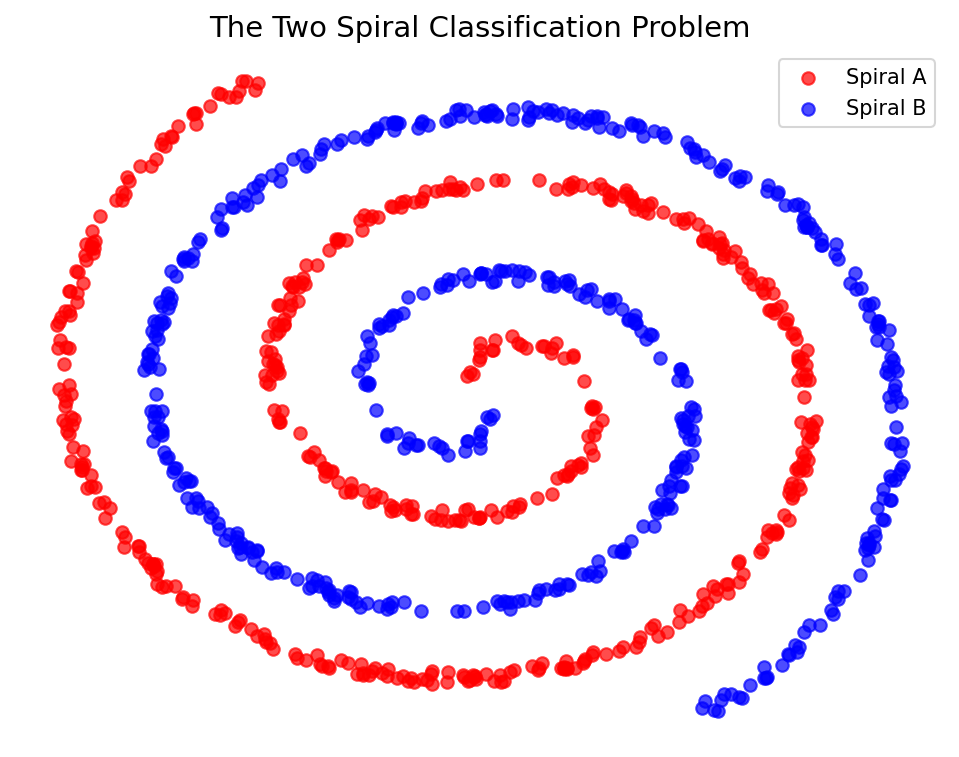

# How Machine Learning Fails: The Problem of Non-Linearity

This study note explains a primary scenario where traditional Machine Learning models struggle and often fail: handling highly complex, non-linear data.

## The Core Issue: Non-Linearity

Traditional Machine Learning algorithms (especially linear models) attempt to separate data using straight lines (or flat hyperplanes in higher dimensions). However, real-world data is rarely perfectly linearly separable. 

When data points from different categories are intertwined or arranged in complex shapes, a simple straight line cannot accurately separate them. This limitation is known as the **Non-Linearity** problem.

### 1. Complex Decision Boundaries
As illustrated in the lesson, if you have a complex distribution of data (e.g., two classes arranged in a curved or alternating pattern), a linear ML model will attempt to draw a straight line through them. This results in poor classification because a straight line cannot capture the true "complex" boundary separating the classes. 

### 2. The Two Spiral Classification Problem
A classic, extreme example of traditional Machine Learning failing is the **Two Spiral Classification** problem.

- Imagine two distinct datasets (Class A and Class B) arranged in the shape of two intertwined spirals.
- A standard linear model is completely incapable of drawing a decision boundary that successfully follows the curves of the spirals.
- Solving this requires a model capable of learning highly non-linear functions to correctly classify points belonging to Spiral A versus Spiral B.

---

## Conclusion
Because traditional Machine Learning models often fail to capture these complex, non-linear patterns without extensive manual feature engineering, we turn to **Deep Learning**. Deep Learning, powered by Neural Networks, utilizes non-linear activation functions across multiple layers. This allows it to naturally learn and model highly complex, curved decision boundaries (like the two spirals) with ease!
