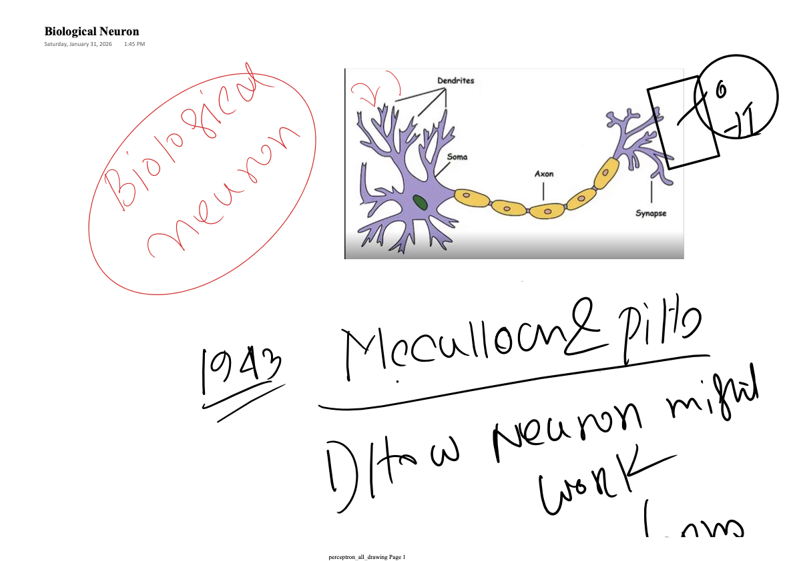

# How a Biological Neuron Works

This section introduces the foundational concept behind Artificial Neural Networks (ANNs): the biological neuron.

## 1. The McCulloch-Pitts Neuron (1943)
In 1943, Warren McCulloch and Walter Pitts created the first mathematical model of a biological neuron. Their goal was to understand **how a neuron might work** logically and computationally.

## 2. The Brain Performs Logical Operations
The core idea is that the brain processes information by performing logical operations. Much like how a computer uses logic gates (AND, OR, NOR), early models suggested that biological neurons do something very similar when deciding whether to fire (send a signal) or not.

## 3. The Activation Threshold
A biological neuron's output depends on a specific **threshold**. 
- It receives various signals from other neurons.
- If the combined strength of the incoming signals exceeds a certain threshold, the neuron "fires" (outputs a 1).
- If the signals are below the threshold, it remains inactive (outputs a 0).

## 4. Modeling Basic Logic Gates
Because of their binary nature (fire or don't fire), these simple threshold-based neurons can be mathematically configured to perform standard logic operations, such as:
- **AND**
- **OR**
- **NOR**

## 5. Hierarchical Information Processing (Example: Recognizing an Apple)
To understand how a network of these neurons makes complex decisions, consider the example of recognizing an **Apple**:
- **Layer 1 (L1):** Detects basic, raw attributes like `Red Color` and `Round Shape`.
- **Layer 2 (L2):** Combines L1 outputs to recognize more complex concepts, such as identifying the object as `Food`.
- **Layer 3 (L3):** Determines higher-level properties, such as if the food is `Edible`.
- **Decision (Output):** Based on these sequential logical operations, the network reaches a final decision, such as identifying the object as an Apple and classifying it as `No Danger`.

---

### Visual Reference
Below is the visual diagram illustrating the biological neuron concept and the hierarchical flow of information:

