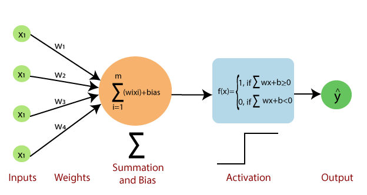

# The Perceptron: Architecture and Mathematical Intuition

The **Perceptron** is the simplest form of an Artificial Neural Network, representing a single artificial neuron. This document covers its architecture, the mathematical formulas driving it, and how it learns by updating its weights.

## 1. Perceptron Architecture

A Perceptron consists of four primary components:
1. **Inputs ($x$):** The features from our dataset (e.g., $x_1, x_2, x_3$).
2. **Weights ($w$):** Each input is multiplied by a corresponding weight ($w_1, w_2, w_3$). The weight signifies the importance of that specific input.
   - *Why multiply?* If a feature is completely irrelevant to the decision, the model can set its weight to 0 ($x_i \cdot 0 = 0$), effectively ignoring it.
3. **Summation and Bias ($\Sigma$):** All the weighted inputs are added together, and a **bias ($b$)** is added to the sum.
   - **Formula:** $\sum_{i=1}^m (w_i \cdot x_i) + bias$
   - *Why Bias?* The bias acts as an intercept. Without it, the decision boundary would always be forced to pass through the origin (0,0). It prevents the problem of "dead neurons" by allowing the activation function to shift left or right.
4. **Activation Function:** The final sum is passed through an activation function to generate the output ($\hat{y}$). For a basic perceptron, this is usually a **Step Function**.

## 2. The Step Function (Decision Making)

The Step Function acts as the decision boundary. It takes the output of the summation and converts it into a binary output ($0$ or $1$):

$$ f(x) = \begin{cases} 1, & \text{if } \sum (w_i \cdot x_i) + b \ge 0 \\ 0, & \text{if } \sum (w_i \cdot x_i) + b < 0 \end{cases} $$

If the result of the weighted sum plus bias is positive (or zero), the neuron fires (outputs $1$). Otherwise, it stays inactive (outputs $0$).

## 3. How a Perceptron Learns (Weight Updating Formulas)

A perceptron learns by adjusting its weights and bias whenever it makes an incorrect prediction. 

### Weight Update Formula
$$ W_{new} = W_{old} + \eta \cdot (y - \hat{y}) \cdot x_i $$

Where:
- **$W_{new}$**: The updated weight.
- **$W_{old}$**: The current weight.
- **$\eta$ (Eta)**: The **Learning Rate** (e.g., $0.1$). This controls how big of a step the model takes when updating the weights.
- **$y$**: The actual (true) target label.
- **$\hat{y}$**: The model's predicted output.
- **$x_i$**: The specific input feature.

### Bias Update Formula
The bias is updated using the exact same error term, but it is not multiplied by the input $x_i$:

$$ b_{new} = b_{old} + \eta \cdot (y - \hat{y}) $$

By repeatedly applying these updating formulas to the training data, the perceptron slowly shifts its decision boundary (the straight line) until it correctly classifies the data!
