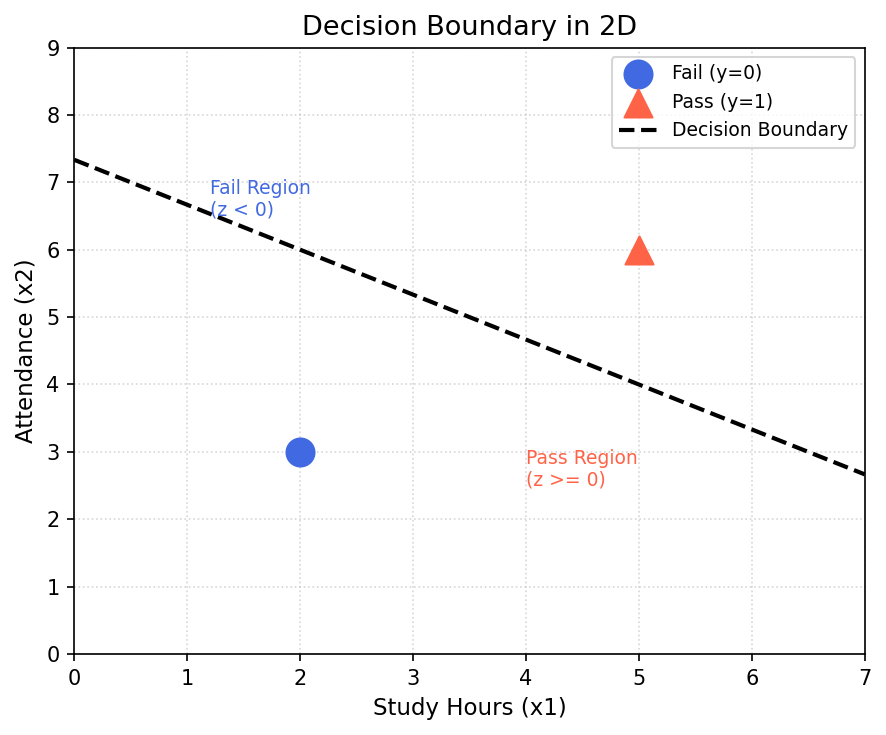
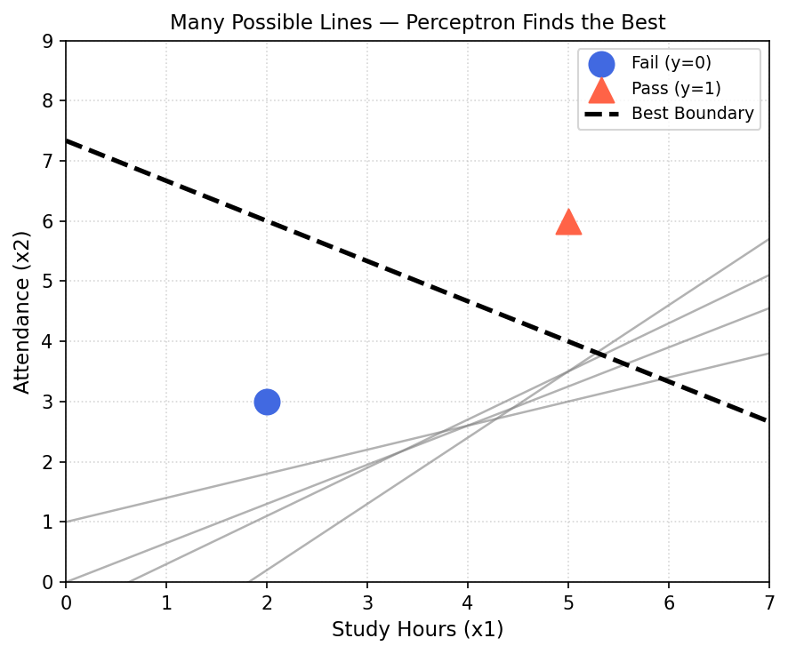

# Decision Boundary

---

## 1. What is a Decision Boundary?

A **decision boundary** is the line (or surface) that a perceptron draws in the input feature space to **separate two classes** from each other.

- Every point on one side of the line → classified as **Class 1**
- Every point on the other side → classified as **Class 0**

The entire goal of training a perceptron is to find the exact position and orientation of this line so that it correctly separates the data.

---

## 2. A Concrete Example — Pass or Fail?

Consider a dataset where we want to predict whether a student **passes (1)** or **fails (0)** based on two features:
- $x_1$ = Study Hours
- $x_2$ = Attendance

| Study Hours ($x_1$) | Attendance ($x_2$) | Pass/Fail ($y$) |
|:---:|:---:|:---:|
| 2 | 3 | 0 (Fail) |
| 5 | 6 | 1 (Pass) |

The perceptron must find a line that places the **Fail** point on one side and the **Pass** point on the other.

---

## 3. The Equation of the Decision Boundary

The perceptron computes a weighted sum and applies a step function:

$$z = w_1 x_1 + w_2 x_2 + c$$

$$\hat{y} = \begin{cases} 1 & \text{if } z \ge 0 \\ 0 & \text{if } z < 0 \end{cases}$$

The **decision boundary itself is the line where $z = 0$**:

$$w_1 x_1 + w_2 x_2 + c = 0$$

> The weights ($w_1$, $w_2$) are the **coefficients** of this line, and $c$ is the constant term (related to the bias). Changing the weights literally rotates and repositions the decision boundary.

For example, with $w_1 = 2$, $w_2 = 3$, and $c = -22$:

$$2x_1 + 3x_2 - 22 = 0$$

A point like $(5, 6)$: $z = 2(5) + 3(6) - 22 = 10 + 18 - 22 = 6 \ge 0 \implies \hat{y} = 1$ (Pass)

A point like $(2, 3)$: $z = 2(2) + 3(3) - 22 = 4 + 9 - 22 = -9 < 0 \implies \hat{y} = 0$ (Fail)

---

## 4. Visual: Decision Boundary in 2D

The plot below shows how a single straight line separates the two classes. Points in the **blue region** ($z < 0$) are Fail; points in the **red region** ($z \ge 0$) are Pass.

---

## 5. The Step Function

The activation function that converts the raw score $z$ into a final class label is the **Step Function**:

$$\hat{y} = \begin{cases} 1 & \text{if } z \ge 0 \\ 0 & \text{if } z < 0 \end{cases}$$

This is what makes the perceptron a **hard classifier** — it gives a definitive `0` or `1` with no middle ground.

---

## 6. Many Possible Boundaries — Training Finds the Best One

Before training, any line drawn through the feature space is a valid candidate for the decision boundary. Training adjusts the weights iteratively until the boundary correctly separates all the classes.

Each gray line is a different possible boundary. The perceptron's weight update rule navigates through all these possibilities to converge on the best-fitting line (black dashed).

---

## 7. Decision Boundary in Higher Dimensions

The concept of a "line" generalizes as the number of features grows:

| Number of Features | Decision Boundary |
|:---:|:---|
| 2 ($x_1, x_2$) | A **line** in 2D space |
| 3 ($x_1, x_2, x_3$) | A **plane** in 3D space |
| $n$ features | A **hyperplane** in $n$-dimensional space |

In all cases, the equation remains the same form:

$$w_1 x_1 + w_2 x_2 + \cdots + w_n x_n + c = 0$$

---

## 8. The Role of Bias ($c$)

The constant term $c$ in the boundary equation is directly tied to the **bias** of the perceptron. Its job is to **shift the decision boundary** so it doesn't have to pass through the origin.

Without bias, the line $w_1 x_1 + w_2 x_2 = 0$ is always forced through $(0, 0)$, severely limiting what the perceptron can learn. With bias, the boundary can be placed **anywhere** in the feature space.

---

## Summary

| Concept | Key Point |
|---|---|
| **Decision Boundary** | The line/plane that separates two classes |
| **Equation** | $w_1 x_1 + w_2 x_2 + c = 0$ at the boundary |
| **$z \ge 0$** | Predict Class 1 |
| **$z < 0$** | Predict Class 0 |
| **Weights** | Coefficients that control the slope and orientation of the boundary |
| **Bias ($c$)** | Shifts the boundary away from the origin |
| **Higher Dimensions** | Line → Plane → Hyperplane |
| **Training Goal** | Adjust weights until the boundary correctly separates all classes |
