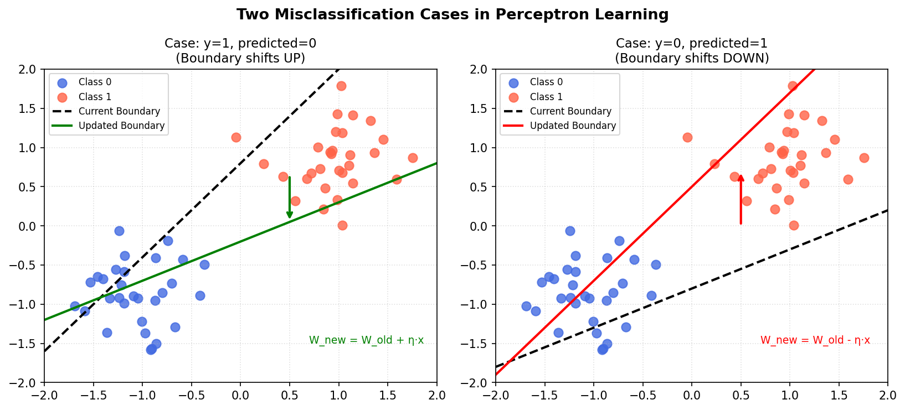
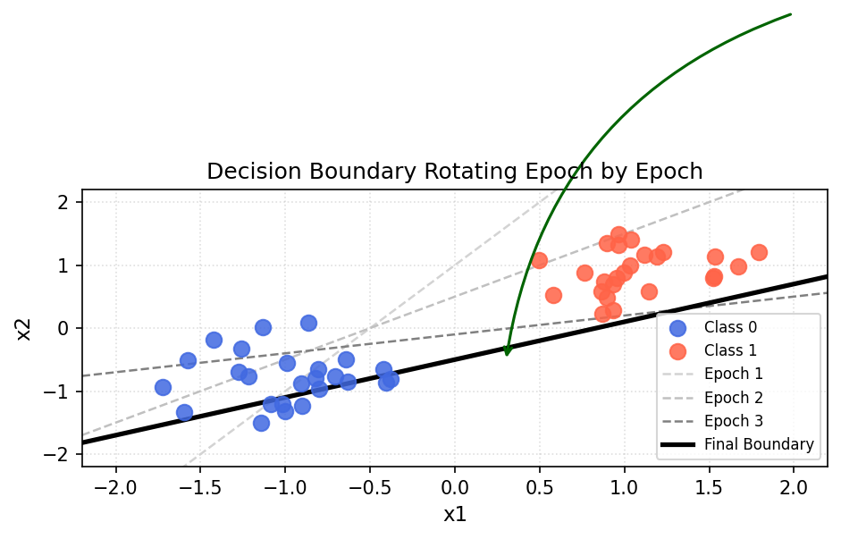

# Perceptron Learning Rule

---

## 1. The Core Idea

The perceptron is not just a classifier — it is a **self-correcting** classifier. When it predicts correctly, nothing changes. When it makes a mistake, it **adjusts the decision boundary** to correct itself.

The mechanism behind this adjustment is the **Perceptron Learning Rule**.

---

## 2. The Decision Boundary as a Linear Equation

Recall from the previous section that the decision boundary is a line:

$$Ax + By + C = 0$$

In perceptron notation, $A$, $B$, and $C$ are the **coefficients** (i.e., the weights and bias):

$$w_1 x_1 + w_2 x_2 + c = 0$$

And with $n$ features, the compact general form is:

$$\sum_{i=0}^{n} w_i x_i = 0 \quad \text{where } x_0 = 1 \text{ (bias input)}$$

The perceptron's job is to find the correct values of $[w_1, w_2, \ldots, w_n, c]$ — the coefficients that place the boundary in the right position.

---

## 3. The Update Rule Formula

Every time the perceptron makes a wrong prediction, the coefficients are updated using:

$$W_{new} = W_{old} + \eta \cdot (y - \hat{y}) \cdot x_i$$

Where:
- $W_{old}$ — the current weight (coefficient)
- $\eta$ — the learning rate (controls step size)
- $y$ — the true label
- $\hat{y}$ — the predicted label
- $x_i$ — the input feature associated with that weight

This can equivalently be written as:

$$Coeff_{new} = Coeff_{old} + \eta \cdot (y - \hat{y}) \cdot x_i$$

---

## 4. The Two Misclassification Cases

The term $(y - \hat{y})$ can only be $+1$, $-1$, or $0$. Only two cases trigger a weight update:

### Case 1: True label is 1, predicted 0 — $(y - \hat{y}) = +1$

The point belongs to **Class 1** but was predicted as **Class 0**. The boundary missed it — it needs to shift to include this point.

$$W_{new} = W_{old} + \eta \cdot x_i$$

> The boundary **rotates upward** (toward the positive point), pulling the misclassified point to the correct side.

### Case 2: True label is 0, predicted 1 — $(y - \hat{y}) = -1$

The point belongs to **Class 0** but was predicted as **Class 1**. The boundary overreached — it needs to pull back.

$$W_{new} = W_{old} - \eta \cdot x_i$$

> The boundary **rotates downward** (away from the negative point), pushing the misclassified point to the correct side.

### Case 3: Prediction correct — $(y - \hat{y}) = 0$

No update. The weights stay the same.

---

## 5. Visual: The Two Cases in Action

The diagrams below show how the decision boundary shifts for each type of misclassification:

---

## 6. How the Boundary Rotates Over Epochs

With every error, the boundary rotates slightly toward the correct orientation. Over multiple training epochs, it converges to the line that correctly separates all classes.

This is the **number of misclassified points** that drives the rotation — more mistakes in one direction cause a larger cumulative shift.

---

## 7. A Worked Example

Suppose the current decision boundary is:

$$2x + 3y + 5 = 0 \quad \Rightarrow \quad \text{Coefficients: } [2,\ 3,\ 5]$$

A misclassified point with coordinates $(x_1, x_2) = (6, 2)$ and bias $x_0 = 1$ has the full input vector:

$$\mathbf{x} = [x_1, x_2, x_0] = [6, 2, 1]$$

With learning rate $\eta = 0.1$ and error $(y - \hat{y}) = -1$ (Case 2 — predicted 1, actual 0):

| Coefficient | Old Value | Update $(-\eta \cdot x_i)$ | New Value |
|:---:|:---:|:---:|:---:|
| $A$ (for $x_1$) | 2 | $-0.1 \times 6 = -0.6$ | **1.4** |
| $B$ (for $x_2$) | 3 | $-0.1 \times 2 = -0.2$ | **2.8** |
| $C$ (bias) | 5 | $-0.1 \times 1 = -0.1$ | **4.9** |

New boundary equation:

$$1.4x + 2.8y + 4.9 = 0$$

---

## 8. Summary

| Concept | Key Point |
|---|---|
| **Perceptron Learning Rule** | $W_{new} = W_{old} + \eta(y - \hat{y}) \cdot x_i$ |
| **No error** | Weights unchanged |
| **Error = +1** (missed a positive) | $W_{new} = W_{old} + \eta \cdot x_i$ → boundary shifts toward point |
| **Error = −1** (misclassified a negative) | $W_{new} = W_{old} - \eta \cdot x_i$ → boundary shifts away |
| **Learning Rate $\eta$** | Controls how big each correction step is |
| **Convergence** | If data is linearly separable, the rule is guaranteed to find the correct boundary |
