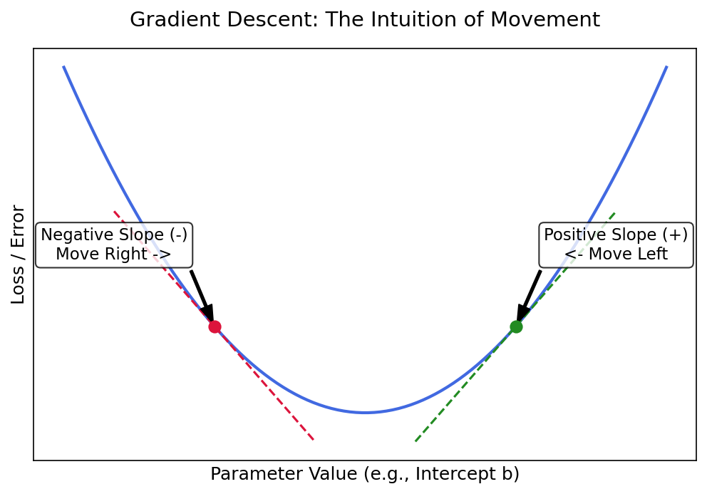

# Gradient Descent

---

## 1. What is Gradient Descent?

Gradient Descent is an optimization algorithm used to find the lowest point (minimum) of a curve. In machine learning, we use it to find the best parameters (like the slope $m$ and intercept $b$ of a line) that result in the lowest possible error for our model.

- It starts with a random guess.
- It calculates the direction of the steepest decrease in error.
- It takes a small step in that downhill direction.
- It repeats this process until it reaches the bottom (minimum error).

---

## 2. A Concrete Example — Predicting Attendance

Consider a scenario where we want to predict a student's **Attendance** ($y$) based on their **Study Hours** ($x$) using a simple straight line:

$$ \hat{y} = mx + b $$

| Study Hours ($x$) | Attendance ($y$) |
|:---:|:---:|
| 2 | 30 |
| 5 | 75 |

We want to find the exact Slope ($m$) and Intercept ($b$) that fits this data as closely as possible.

---

## 3. The Setup: Linear Regression and Loss

To know if our guessed line is good or bad, we measure the **Loss** (Error).
The Loss is calculated using the Sum of Squared Errors. We take the difference between the actual attendance ($y_i$) and our predicted attendance ($\hat{y}_i$), square it, and sum it up for all $n$ students:

$$ L = \sum_{i=1}^{n} (y_i - \hat{y}_i)^2 $$

Substituting our line equation into the loss function gives us:

$$ L = \sum_{i=1}^{n} (y_i - mx_i - b)^2 $$

The entire goal of Gradient Descent is to find the exact $m$ and $b$ that make $L$ as close to zero as possible.

---

## 4. A Simpler Scenario — Fixing $m$ to find $b$

To understand how the algorithm works, let's pretend we already know the perfect Slope is exactly $m = 10$. Now we only need to find the best Intercept, $b$.

Our loss function simplifies to a 2D U-shaped curve (a parabola):

$$ L(b) = \sum_{i=1}^{n} (y_i - 10x_i - b)^2 $$

> If you drop a physical ball on the side of this U-shaped curve, it naturally rolls downhill to the bottom. Gradient Descent does the exact same thing mathematically.

### The Intuition of Movement (Walking Downhill)

To move our guess closer to the bottom, we look at the steepness (gradient) of the curve.
- If the steepness is positive, we move left (negative direction).
- If the steepness is negative, we move right (positive direction).

This logical deduction gives us our core update rule:

$$ b_{new} = b_{old} - \eta \times \frac{dL}{db} $$

*(Where **η** is the Learning Rate or step size, and **dL/db** is the steepness/slope of the curve).*

### Calculating the Derivative for $b$

Let's find the slope formula ($\frac{dL}{db}$) using the chain rule from calculus:

$$ \frac{dL}{db} = 2 \sum_{i=1}^{n} (y_i - 10x_i - b) \cdot (-1) $$

$$ \frac{dL}{db} = -2 \sum_{i=1}^{n} (y_i - 10x_i - b) $$

---

## 5. The Real Problem — Two Unknowns ($m$ and $b$)

In reality, we don't know the Slope. We have to find both $m$ and $b$ simultaneously. Our simple U-shape becomes a 3D bowl shape:

$$ L(m,b) = \sum_{i=1}^{n} (y_i - mx_i - b)^2 $$

To solve this, we must use **Partial Derivatives**. This means we find the slope for $b$ while treating $m$ as a constant, and find the slope for $m$ while treating $b$ as a constant.

### 5.1. Partial Derivative with respect to $b$

$$ \frac{\partial L}{\partial b} = 2 \sum_{i=1}^{n} (y_i - mx_i - b) \cdot (-1) $$

$$ \frac{\partial L}{\partial b} = -2 \sum_{i=1}^{n} (y_i - mx_i - b) $$

### 5.2. Partial Derivative with respect to $m$

$$ \frac{\partial L}{\partial m} = 2 \sum_{i=1}^{n} (y_i - mx_i - b) \cdot (-x_i) $$

$$ \frac{\partial L}{\partial m} = -2 \sum_{i=1}^{n} (y_i - mx_i - b) \cdot x_i $$

---

## 6. The Final Gradient Descent Algorithm

We apply our downhill update rule to both variables at the exact same time:

$$ b_{new} = b_{old} - \eta \times \frac{\partial L}{\partial b} $$
$$ m_{new} = m_{old} - \eta \times \frac{\partial L}{\partial m} $$

We repeat these updates over and over (these loops are called **Epochs**) until our values stop changing. When they stop changing, it means we have successfully reached the bottom of the bowl and found our perfect line!

---

## Summary

| Concept | Key Point |
|---|---|
| **Gradient Descent** | An algorithm that walks downhill to find the lowest point of an error curve. |
| **Loss ($L$)** | The total measure of how wrong our current predictions are. |
| **Partial Derivatives** | Tells us which direction is downhill for each variable independently. |
| **Learning Rate ($\eta$)**| Determines how big of a jump we take downhill in each step. |
| **Epoch** | One full cycle of updating all our guesses. |
| **Goal** | Find the Slope ($m$) and Intercept ($b$) that produce the absolute minimum Loss. |
