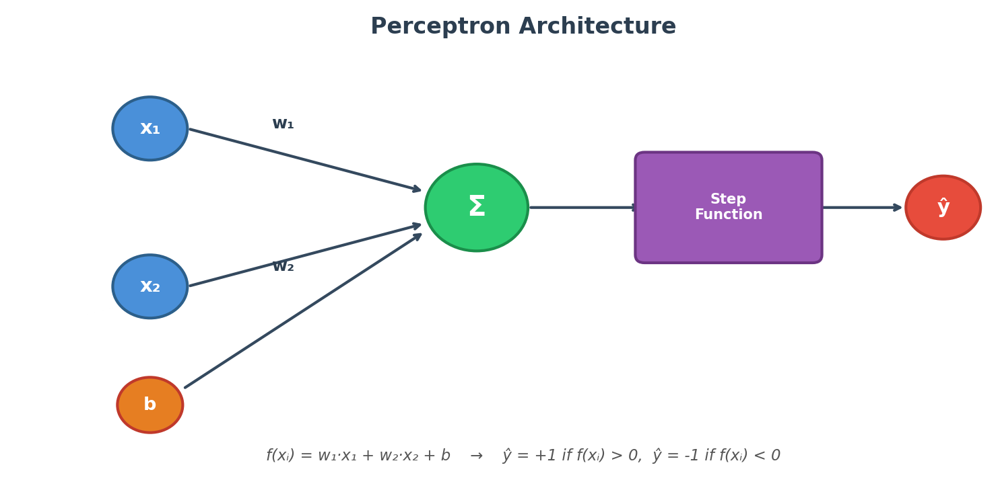
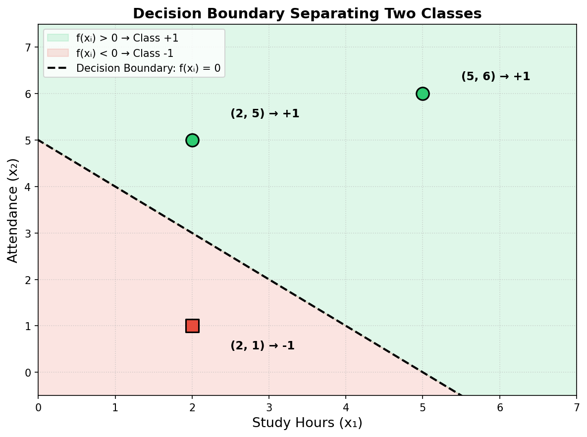
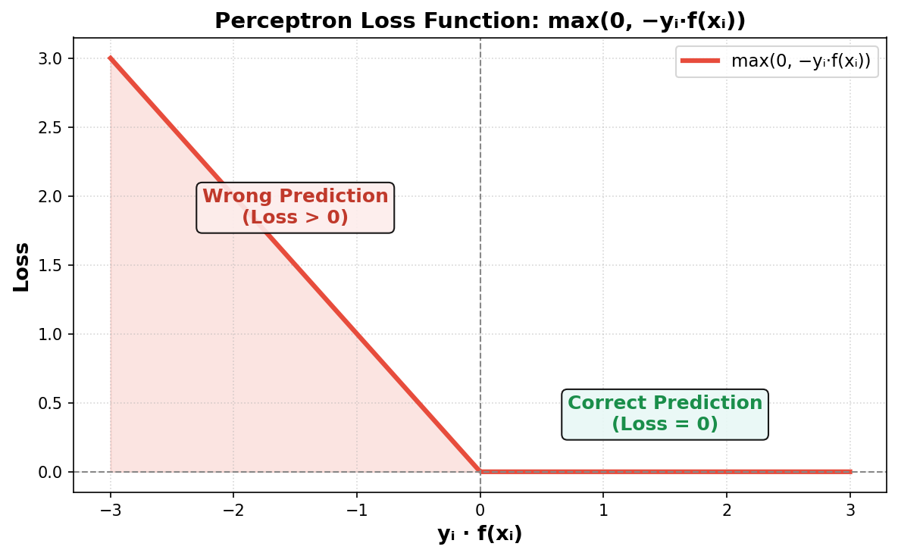

# Perceptron Loss Function

---

## 1. Why Do We Need a Loss Function for the Perceptron?

In the previous topic on **Gradient Descent**, we learned how to minimize error by walking downhill on a loss curve. But that was for **Linear Regression** (predicting continuous values). 

For a **Perceptron** (a classifier that predicts discrete classes like +1 or -1), we need a different kind of loss function — one that measures how badly the perceptron is misclassifying data points.

---

## 2. Perceptron Learning Rule vs Gradient Descent

| Feature | Perceptron Learning Rule | Gradient Descent |
|---|---|---|
| **Data requirement** | Requires data to be linearly separable to converge | Can handle overlapping/non-linearly separable data |
| **Update method** | Discrete updates: $w = w + \eta y x$ | Smooth updates using gradient of a loss function: $w = w + \eta \nabla L$ |
| **Convergence guarantee** | Only guaranteed if data is linearly separable | Can converge to minimum of loss, even if perfect separation not possible |
| **Step control** | Fixed learning rate, can overshoot | Learning rate can be tuned; can use **momentum**, **scheduling** to improve convergence |
| **Error measurement** | Implicit; only cares about correct/incorrect classification | Explicit; minimizes **continuous loss functions** like MSE or cross-entropy |
| **Flexibility** | Works only for single-layer perceptrons | Works for **single-layer and multi-layer networks (MLP)** |

---

## 3. The Perceptron Setup

The perceptron takes in multiple input features (like Study Hours and Attendance), multiplies each by a weight, adds a bias, and passes the result through a **step function** to output a class label.

Given two features $x_1$ and $x_2$, the perceptron computes:

$$f(x_i) = w_1 x_{i1} + w_2 x_{i2} + b$$

- If **f(xᵢ) > 0** → predict **Class +1**
- If **f(xᵢ) < 0** → predict **Class -1**

> The decision boundary is the line where **f(xᵢ) = 0**. Points on one side get classified as +1, and points on the other side get classified as -1.

---

## 4. A Concrete Example — Classifying Students

Consider a dataset where we want to classify students as **Pass (+1)** or **Fail (-1)** based on two features:
- $x_1$ = Study Hours
- $x_2$ = Attendance

| Study Hours ($x_1$) | Attendance ($x_2$) | Class ($y$) |
|:---:|:---:|:---:|
| 2 | 5 | +1 (Pass) |
| 5 | 6 | +1 (Pass) |
| 2 | 1 | -1 (Fail) |

Our goal is to find the weights $w_1$, $w_2$ and bias $b$ such that the perceptron correctly classifies all students.

---

## 5. The Perceptron Loss Function — Hinge-like Loss

The loss function for the perceptron is:

$$L = \frac{1}{n} \sum_{i=1}^{n} \max(0, \; -y_i \cdot f(x_i))$$

Let's break this down piece by piece:

### 5.1. What does yᵢ · f(xᵢ) mean?

This is the product of the **true label** (yᵢ) and the **perceptron's raw output** (f(xᵢ)). It tells us whether the prediction is correct or not:

- **Correct prediction:** yᵢ and f(xᵢ) have the **same sign** → their product is **positive** → yᵢ · f(xᵢ) > 0
- **Wrong prediction:** yᵢ and f(xᵢ) have **opposite signs** → their product is **negative** → yᵢ · f(xᵢ) < 0

### 5.2. What does $\max(0, -y_i \cdot f(x_i))$ do?

The $\max$ function works like this:
- If the value inside is **positive**, it keeps it.
- If the value inside is **negative or zero**, it returns 0.

Let's see all four possible scenarios:

| True Label ($y_i$) | Prediction ($\hat{y}$) | $-y_i \cdot f(x_i)$ | $\max(0, -y_i \cdot f(x_i))$ | Meaning |
|:---:|:---:|:---:|:---:|:---|
| +1 | +1 | Negative | **0** | Correct — no penalty |
| -1 | -1 | Negative | **0** | Correct — no penalty |
| +1 | -1 | Positive | **Positive value** | Wrong — penalty added! |
| -1 | +1 | Positive | **Positive value** | Wrong — penalty added! |

> **Key insight:** The loss is **zero** when the prediction is correct, and **greater than zero** when the prediction is wrong. So the total loss only accumulates from the misclassified points.

---

## 6. The Optimization Goal

We want to find the weights and bias that **minimize** this loss across all data points:

$$\underset{w_1, w_2, b}{\text{argmin}} \quad L = \frac{1}{n} \sum_{i=1}^{n} \max(0, \; -y_i \cdot f(x_i))$$

where:

$$f(x_i) = w_1 x_{i1} + w_2 x_{i2} + b$$

To minimize this, we use **Gradient Descent** — we need to compute the partial derivatives of the loss with respect to each parameter: $\frac{\partial L}{\partial w_1}$, $\frac{\partial L}{\partial w_2}$, and $\frac{\partial L}{\partial b}$.

---

## 7. Deriving the Gradients — Step by Step

### 7.1. Using the Chain Rule

To find the gradient for any weight (say $w_1$), we apply the **chain rule**:

$$\frac{\partial L}{\partial w_1} = \frac{\partial L}{\partial f(x_i)} \times \frac{\partial f(x_i)}{\partial w_1}$$

We need to find each piece separately.

### 7.2. First Piece: $\frac{\partial L}{\partial f(x_i)}$

Since the loss uses $\max(0, -y_i \cdot f(x_i))$, the derivative depends on whether the prediction was correct or wrong:

$$\frac{\partial L}{\partial f(x_i)} = \begin{cases} 0 & \text{if } y_i \cdot f(x_i) \ge 0 \quad \text{(correct prediction)} \\ -y_i & \text{if } y_i \cdot f(x_i) < 0 \quad \text{(wrong prediction)} \end{cases}$$

### 7.3. Second Piece: $\frac{\partial f(x_i)}{\partial w_1}$

Since $f(x_i) = w_1 x_{i1} + w_2 x_{i2} + b$, the derivative with respect to $w_1$ is simply:

$$\frac{\partial f(x_i)}{\partial w_1} = x_{i1}$$

Similarly:
- $\frac{\partial f(x_i)}{\partial w_2} = x_{i2}$
- $\frac{\partial f(x_i)}{\partial b} = 1$

---

## 8. The Final Gradient Formulas (Merging Together)

Multiplying the two pieces from the chain rule, we get the complete gradient for each parameter:

### For $w_1$:

$$\frac{\partial L}{\partial w_1} = \begin{cases} 0 & \text{if } y_i \cdot f(x_i) \ge 0 \\ -y_i \cdot x_{i1} & \text{if } y_i \cdot f(x_i) < 0 \end{cases}$$

### For $w_2$:

$$\frac{\partial L}{\partial w_2} = \begin{cases} 0 & \text{if } y_i \cdot f(x_i) \ge 0 \\ -y_i \cdot x_{i2} & \text{if } y_i \cdot f(x_i) < 0 \end{cases}$$

### For $b$:

$$\frac{\partial L}{\partial b} = \begin{cases} 0 & \text{if } y_i \cdot f(x_i) \ge 0 \\ -y_i & \text{if } y_i \cdot f(x_i) < 0 \end{cases}$$

> **Key insight:** The gradients are **zero for correctly classified points** — the model only updates its weights based on the points it got **wrong**. This makes intuitive sense: if you're already correct, don't change anything!

---

## 9. The Weight Update Rules

Using these gradients, we update the parameters with Gradient Descent:

$$w_1 = w_1 - \eta \cdot \frac{\partial L}{\partial w_1}$$
$$w_2 = w_2 - \eta \cdot \frac{\partial L}{\partial w_2}$$
$$b = b - \eta \cdot \frac{\partial L}{\partial b}$$

Where **η** is the learning rate that controls how big each update step is.

---

## Summary

| Concept | Key Point |
|---|---|
| **Perceptron Output** | $f(x_i) = w_1 x_{i1} + w_2 x_{i2} + b$ |
| **Loss Function** | $L = \frac{1}{n} \sum \max(0, -y_i \cdot f(x_i))$ |
| **Correct prediction** | $y_i \cdot f(x_i) \ge 0$ → Loss is 0, no update needed |
| **Wrong prediction** | $y_i \cdot f(x_i) < 0$ → Loss is positive, weights get updated |
| **Gradient for weights** | Only non-zero for misclassified points |
| **Goal** | Find $w_1$, $w_2$, $b$ that minimize the total loss across all data points |
