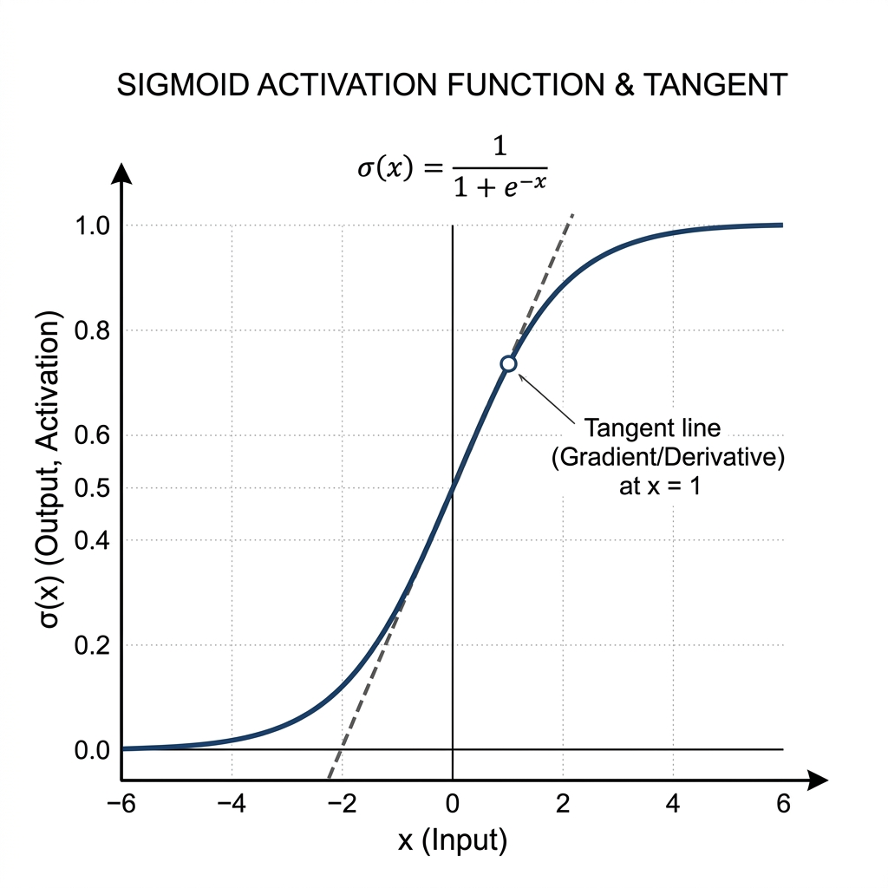

# Sigmoid Activation Function

This document provides a detailed walkthrough of the **Sigmoid Activation Function**, its mathematical properties, and why its differentiation is an essential part of learning in Neural Networks.

## What is the Sigmoid Function?

The Sigmoid function (also known as the logistic function) takes any real-valued number and maps it into a specific, bounded value between **0 and 1**. Because its output strongly resembles a probability score, it is extensively used in the output layer for **Binary Classification** tasks.

**Mathematical Formula:**
$$ \sigma(x) = \frac{1}{1 + e^{-x}} $$

- **Input range:** $x \in (-\infty, \infty)$
- **Output range:** $\sigma(x) \in (0, 1)$
- **Decision Boundary:** Typically, a threshold of `0.5` is used to make decisions. 
  - If $\sigma(x) \geq 0.5$, it predicts Class 1. 
  - If $\sigma(x) < 0.5$, it predicts Class 0.

---

## Visualizing Sigmoid and its Derivative

As seen in the graph, the Sigmoid function is an **S-shaped, smooth, and continuous curve**. This smoothness is critical because it guarantees that we can calculate its gradient (represented by the tangent line) at any point along the curve.

---

## Why Do We Need Differentiation in Sigmoid?

In Deep Learning, neural networks optimize their weights and biases using **Gradient Descent** and the **Backpropagation** algorithm. 

- **The Role of the Chain Rule:** Backpropagation requires applying the **Chain Rule of Calculus** to figure out how much each specific weight contributed to the final error.
- **Passing the Gradient:** To use the Chain Rule, we *must* take the derivative of every single operation the data passes through—including the activation function. 
- **The Optimization Flow:** If the activation function is not differentiable (or has undefined derivatives at certain points), the mathematical error cannot flow backward through the network to update the weights properly, causing the network to stop learning.
- **Bonus Property:** As shown in the derivation below, the derivative of the Sigmoid function can be expressed purely in terms of its output. This makes calculating updates extremely computationally efficient for computers!

---

## Step-by-Step Differentiation of Sigmoid

Let's derive the gradient (derivative) of the Sigmoid function step-by-step using standard calculus rules.

**Given:**
$$ \sigma(x) = \frac{1}{1 + e^{-x}} = (1 + e^{-x})^{-1} $$

**Step 1:** Apply the Power Rule and Chain Rule:
$$ \frac{d}{dx} \sigma(x) = -1 \cdot (1 + e^{-x})^{-2} \cdot \frac{d}{dx}(1 + e^{-x}) $$

**Step 2:** Differentiate the inner term $(1 + e^{-x})$:
$$ \frac{d}{dx}(1 + e^{-x}) = 0 + e^{-x} \cdot \frac{d}{dx}(-x) = e^{-x} \cdot (-1) = -e^{-x} $$

**Step 3:** Substitute the inner derivative back into the main equation:
$$ \frac{d}{dx} \sigma(x) = - (1 + e^{-x})^{-2} \cdot (-e^{-x}) $$
$$ = \frac{e^{-x}}{(1 + e^{-x})^2} $$

**Step 4:** Rearrange the equation to express it elegantly in terms of $\sigma(x)$:
$$ = \left( \frac{1}{1 + e^{-x}} \right) \cdot \left( \frac{e^{-x}}{1 + e^{-x}} \right) $$

Notice that the first term is simply our original function, $\sigma(x)$. Let's mathematically manipulate the second term by adding and subtracting `1` in the numerator:
$$ = \sigma(x) \cdot \left( \frac{1 + e^{-x} - 1}{1 + e^{-x}} \right) $$
$$ = \sigma(x) \cdot \left( \frac{1 + e^{-x}}{1 + e^{-x}} - \frac{1}{1 + e^{-x}} \right) $$
$$ = \sigma(x) \cdot (1 - \sigma(x)) $$

### Final Derivative:
$$ \frac{d}{dx} \sigma(x) = \sigma(x)(1 - \sigma(x)) $$

> **Key Takeaway:** The derivative of the sigmoid function is simply its own output multiplied by `1 - output`. This elegant mathematical property saves an enormous amount of computational power during backpropagation because the network doesn't need to recalculate exponents—it just reuses the forward pass output!
