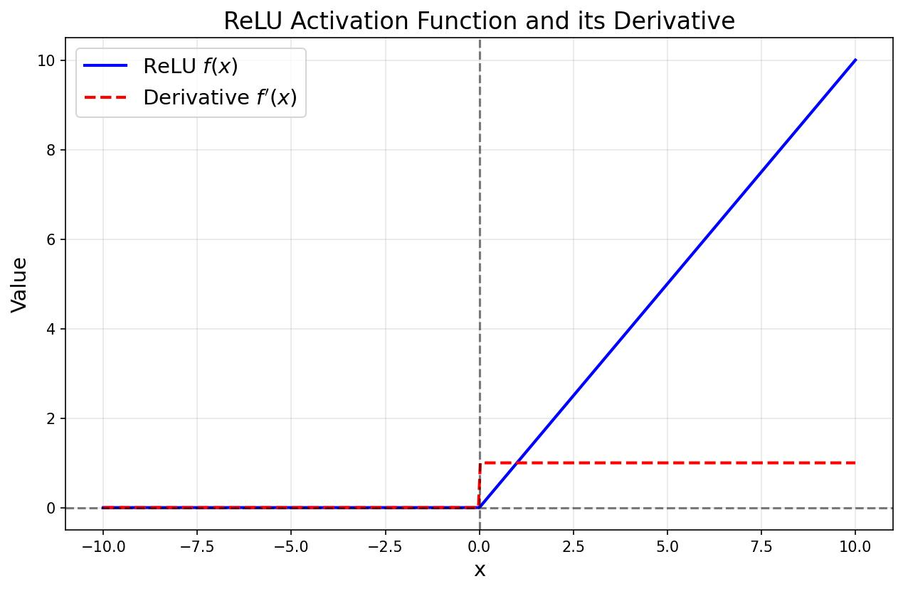

# ReLU Activation Function

This document provides a detailed walkthrough of the **Rectified Linear Unit (ReLU) Activation Function**, its mathematical properties, and why it has become the default activation function for many deep learning models.

## What is the ReLU Function?

The Rectified Linear Unit (ReLU) is a piecewise linear function that will output the input directly if it is positive, otherwise, it will output zero. It has become the most widely used activation function because it is simple to implement, extremely computationally efficient, and helps networks learn much faster than alternatives like Sigmoid or Tanh.

**Mathematical Formula:**

$$
ReLU(x) = \max(0, x)
$$

- **Input range:** $x \in (-\infty, \infty)$
- **Output range:** $ReLU(x) \in [0, \infty)$
- **Decision Boundary:** 
  - If $x \geq 0$, it outputs $x$.
  - If $x < 0$, it outputs $0$.

---

## Visualizing ReLU and its Derivative

As seen in the graph, the ReLU function is exactly $0$ for all negative inputs, and linearly increases with a slope of $1$ for all positive inputs. The derivative (the red dashed line) clearly shows this behavior: it is $0$ when $x < 0$ and $1$ when $x \ge 0$.

---

## Why Do We Need Differentiation in ReLU?

Just like Sigmoid, neural networks using ReLU optimize their weights using **Gradient Descent** and **Backpropagation**. 

- **Solving the Vanishing Gradient Problem:** In Sigmoid and Tanh, the derivative approaches zero for very large or very small inputs, causing the network to stop learning (the vanishing gradient problem). ReLU solves this for positive numbers: its derivative is always exactly $1$, allowing the gradient to flow backward through the network perfectly without shrinking.
- **Sparsity:** Because ReLU outputs strictly $0$ for all negative inputs, many neurons in the network will have an output of $0$. This causes the network to be "sparse", which is highly computationally efficient.
- **The "Dead ReLU" Problem:** One disadvantage is that if a large weight update causes the input to the ReLU to always be negative, the neuron will always output $0$ and its gradient will always be $0$. It stops learning entirely. This is called a "Dead ReLU".

---

## Step-by-Step Differentiation of ReLU

Let's derive the gradient (derivative) of the ReLU function. It is much simpler than Sigmoid!

**Given:**

$$
f(x) = \max(0, x)
$$

This can be written as a piecewise function:

$$
f(x) = 
\begin{cases} 
0 & \text{if } x < 0 \\
x & \text{if } x \geq 0 
\end{cases}
$$

**Step 1:** Differentiate for $x < 0$:

$$
\frac{d}{dx}(0) = 0
$$

**Step 2:** Differentiate for $x \geq 0$:

$$
\frac{d}{dx}(x) = 1
$$

### Final Derivative:

$$
f'(x) = 
\begin{cases} 
0 & \text{if } x < 0 \\
1 & \text{if } x \geq 0 
\end{cases}
$$

> **Key Takeaway:** The derivative of ReLU is incredibly simple: it acts as a gate. If the input was positive during the forward pass, the gate is "open" and the gradient flows backward completely unaltered (multiplied by $1$). If the input was negative, the gate is "closed" and no gradient flows backward (multiplied by $0$). This simplicity makes it blazing fast to compute!
