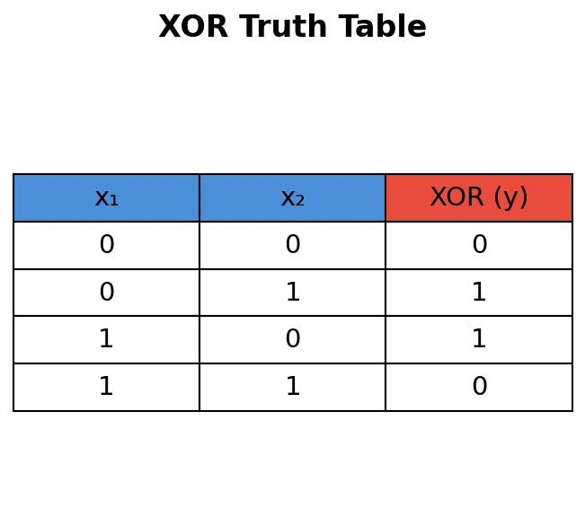
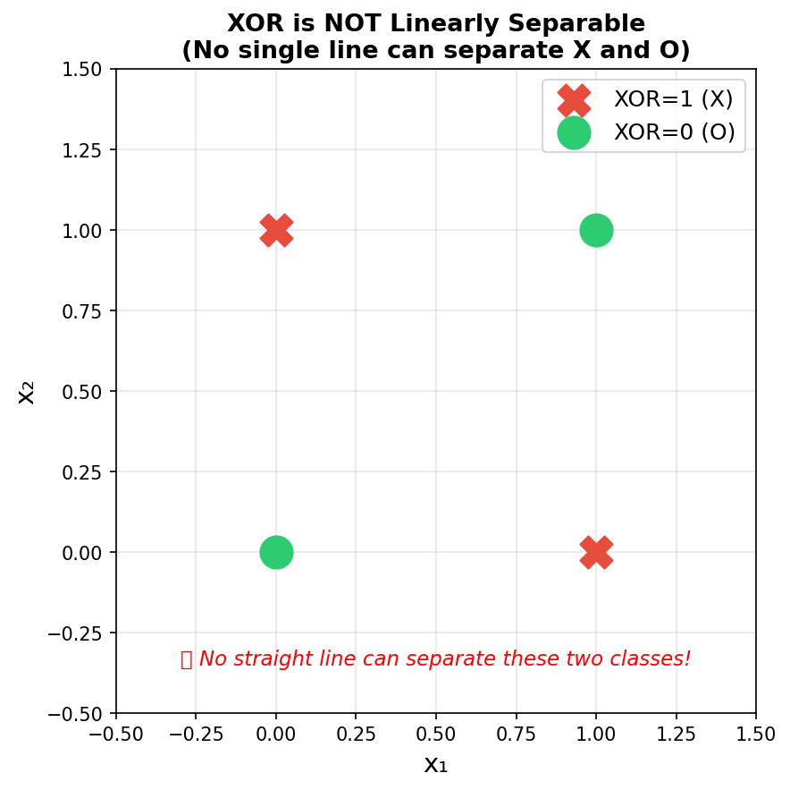
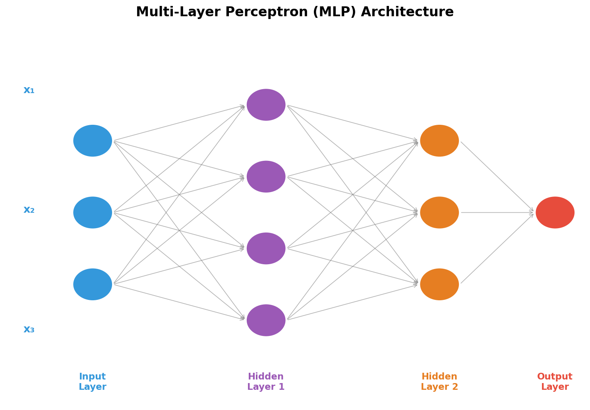
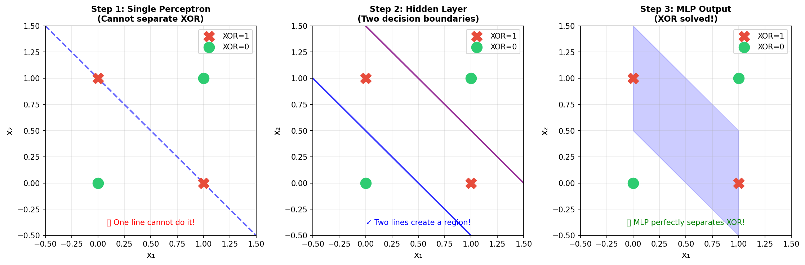
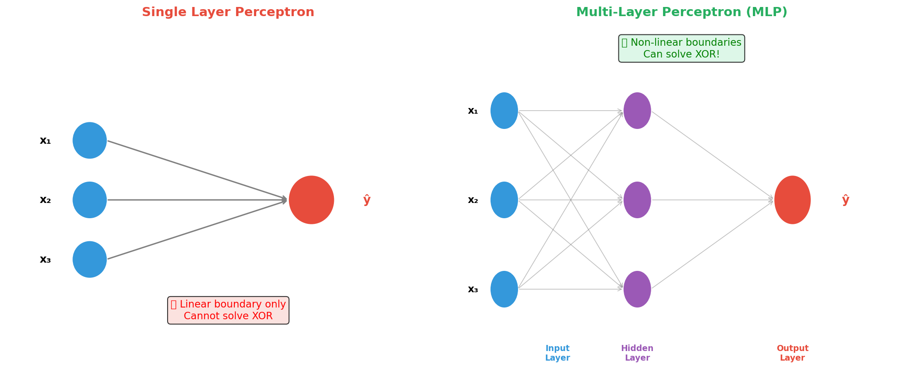

# Main Idea of Multi-Layer Perceptron (MLP)

This document explains why a single-layer perceptron fails on certain problems like XOR, and how a **Multi-Layer Perceptron (MLP)** solves them by stacking multiple layers of neurons.

---

## 1. Quick Recap: What is a Single-Layer Perceptron?

A **Single-Layer Perceptron** is the simplest form of a neural network. It takes multiple inputs, multiplies each by a weight, sums them up, and passes the result through an activation function (like Sigmoid) to produce a single output.

The computation is:

$$
z = w_1 x_1 + w_2 x_2 + \ldots + w_n x_n + b
$$

$$
\hat{y} = \sigma(z)
$$

A single perceptron learns by drawing **one straight line** (or hyperplane in higher dimensions) to separate two classes. This is called a **linear decision boundary**.

---

## 2. The XOR Problem: Why a Single Layer Fails

The **XOR (Exclusive OR)** gate is a classic problem that exposed the fundamental limitation of single-layer perceptrons.

### XOR Truth Table

The rules are simple:
- Output is **1** when the inputs are **different**
- Output is **0** when the inputs are the **same**

### Why is XOR a Problem?

Let's plot the four XOR data points on a 2D graph:

As you can see, the **red X points (output = 1)** and **green O points (output = 0)** are arranged in a diagonal pattern. **No single straight line can separate them.**

> **This is the core limitation of a single-layer perceptron: it can only create LINEAR decision boundaries.** XOR is not linearly separable, so a single perceptron will always fail on it.

---

## 3. The Solution: Multi-Layer Perceptron (MLP)

The idea is beautifully simple: **connect multiple perceptrons together!**

Instead of one layer trying to draw one line, we give the network a **hidden layer** that transforms the input space into a new representation where the problem *becomes* linearly separable.

### From One Perceptron to an MLP

A multi-layer perceptron is built progressively:

1. **One perceptron:** Each input is multiplied by a weight, combined with a bias, and passed through an activation function to produce one output.
2. **One layer of perceptrons:** Several perceptrons receive the same input features. Each one learns its own weights, bias, and decision boundary, so the layer produces several outputs.
3. **Connected layers:** The outputs of the first layer become the inputs to the next layer. Connecting another group of perceptrons allows the network to combine the features discovered earlier.
4. **Output perceptron:** The final layer combines the last hidden-layer outputs and produces the prediction.

In a fully connected MLP, every neuron in one layer is connected to every neuron in the next layer. The connection has a weight, and every neuron has its own bias. The network does not simply repeat the same perceptron: each neuron learns different parameters and therefore learns a different feature or boundary.

For an input vector $\mathbf{x} = [x_1, x_2, x_3]$, a hidden layer with four neurons computes four different results:

$$
\mathbf{z}^{(1)} = W^{(1)}\mathbf{x} + \mathbf{b}^{(1)}
$$

The activation function is applied element by element:

$$
\mathbf{a}^{(1)} = f(\mathbf{z}^{(1)})
$$

The next layer uses those four outputs as its inputs. For example, a second hidden layer with three neurons computes:

$$
\mathbf{z}^{(2)} = W^{(2)}\mathbf{a}^{(1)} + \mathbf{b}^{(2)},
\qquad
\mathbf{a}^{(2)} = f(\mathbf{z}^{(2)})
$$

Finally, the output layer combines the second hidden layer:

$$
\hat{y} = g\left(W^{(3)}\mathbf{a}^{(2)} + \mathbf{b}^{(3)}\right)
$$

Here, each superscript identifies a layer, $W$ contains the connection weights, $b$ contains the biases, and $f$ and $g$ are activation functions. This sequence of calculations is called **forward propagation**.

### How MLP Solves XOR Step by Step

| Step | What Happens |
|---|---|
| **Step 1** | A single line tries (and fails) to separate the XOR points |
| **Step 2** | The hidden layer creates **two** decision boundaries, carving out a region |
| **Step 3** | The combination of two lines perfectly isolates the two classes |

> **Key Insight:** The hidden layer neurons each learn a simple linear boundary. The **output layer** then *combines* the outputs of the hidden neurons to learn a non-linear boundary overall.

---

## 4. MLP Architecture

An MLP has three types of layers:

- **Input Layer:** Receives the raw input features ($x_1, x_2, \ldots, x_n$). No computation happens here.
- **Hidden Layer(s):** The core of the network. Each neuron applies a weighted sum and an **activation function**. This is where non-linearity is introduced. There can be one or many hidden layers.
- **Output Layer:** Produces the final prediction $\hat{y}$ (a single value for regression/binary classification, or multiple values for multi-class classification).

The arrows in the architecture diagram represent learned connections, not just data flow. During training, backpropagation adjusts these weights and biases so that the complete sequence of layers produces better predictions.

---

## 5. Single Layer vs. Multi-Layer: A Side-by-Side Comparison

| Feature | Single-Layer Perceptron | Multi-Layer Perceptron (MLP) |
|---|---|---|
| **Layers** | Input + Output only | Input + Hidden(s) + Output |
| **Decision Boundary** | Linear (straight line) | Non-linear (curves, complex shapes) |
| **Can solve XOR?** | No | Yes |
| **Can learn complex patterns?** | No | Yes |
| **Key Requirement** | — | Non-linear activation function in hidden layers |

---

## 6. Why Does Adding Layers Work?

Adding layers stacked with **non-linear activation functions** (like ReLU or Sigmoid) gives the network the power to learn much more complex functions. Each layer builds a more useful representation of the data:

- **First hidden layer:** learns simple features or boundaries from the raw inputs.
- **Later hidden layers:** combine earlier features into shapes, patterns, or more abstract representations.
- **Output layer:** combines the final representation to make the prediction.

> **Universal Approximation Theorem:** An MLP with even a single hidden layer (and enough neurons) can approximate *any* continuous mathematical function to arbitrary precision. This is the theoretical foundation of why deep learning is so powerful!

---

## 7. Summary

| Concept | Key Point |
|---|---|
| **XOR Problem** | Cannot be solved by a single-layer perceptron because it is not linearly separable |
| **Why single layer fails** | It can only draw one straight decision boundary |
| **How MLP solves it** | Hidden layers transform the input space; multiple boundaries combine to create non-linear separation |
| **The secret ingredient** | Non-linear activation functions in hidden layers |
| **MLP Structure** | Input Layer → Hidden Layer(s) → Output Layer |

> **Takeaway:** The XOR problem was historically significant — it proved that single-layer perceptrons were fundamentally limited, and directly motivated the invention of multi-layer networks and the backpropagation algorithm that trains them.
