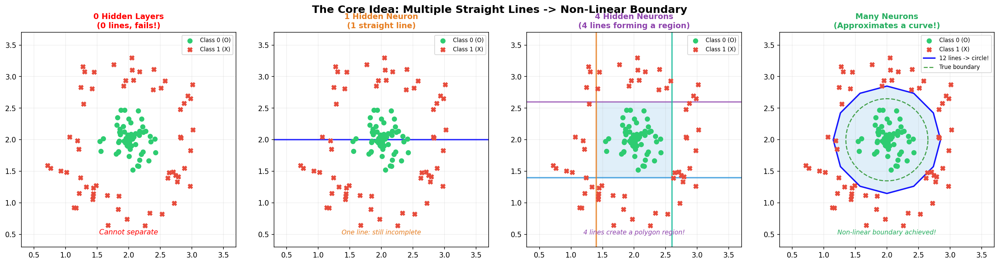
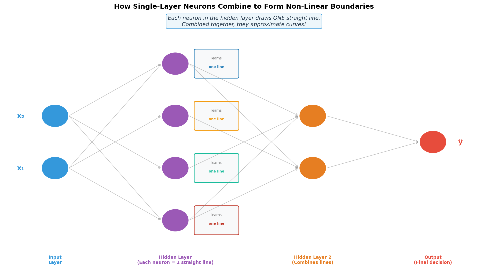
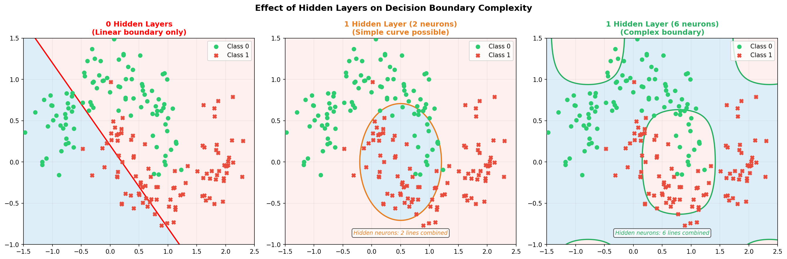
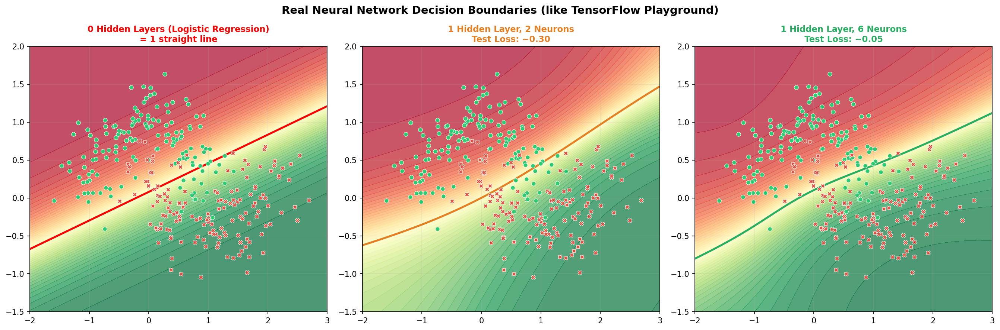

# Main Idea of Multi-Layer Perceptron (MLP)

This document explains the **core intuition** behind Multi-Layer Perceptrons: how stacking simple straight-line decisions together builds the power to learn complex, curved, non-linear boundaries — and why this is the breakthrough that makes deep learning work.

---

## 1. The Starting Point: A Single Neuron Draws ONE Straight Line

A single perceptron (or a single neuron in a network) performs a weighted sum:

$$
z = w_1 x_1 + w_2 x_2 + b
$$

When plotted, the line $w_1 x_1 + w_2 x_2 + b = 0$ is always a **straight line** in 2D (or a flat plane in higher dimensions). This is the neuron's **decision boundary** — the line separating the two classes.

> **Key Constraint:** One neuron = one straight line. A single-layer network can only ever draw ONE straight line as its boundary, no matter how long you train it.

---

## 2. The XOR Problem: Proof That One Line Is Not Enough

The **XOR (Exclusive OR)** gate is a classic example that proves this limitation:

| x₁ | x₂ | XOR (y) |
|:--:|:--:|:-------:|
| 0  | 0  |    0    |
| 0  | 1  |    1    |
| 1  | 0  |    1    |
| 1  | 1  |    0    |

The two classes (0 and 1) are arranged diagonally. **No single straight line can separate them.** You would need at least two lines to create a region that isolates one class from the other.

---

## 3. The Core Idea: Multiple Straight Lines → A Curve

This is the central insight of the MLP:

> **You cannot draw a curve with one line. But if you combine enough straight lines, you can approximate ANY curve.**

Think about drawing a circle using only straight line segments (a polygon). With 4 sides it looks like a square. With 12 sides it starts looking like a circle. With 100 sides, it IS a circle for all practical purposes.

**This is exactly what a hidden layer does:**

- Each neuron in the hidden layer learns **one straight line** (one linear boundary)
- The output layer **combines** all these straight lines
- The result is a **non-linear, curved boundary** that can classify complex data

---

## 4. MLP Architecture: How Layers Are Connected

From your notes, the structure of an MLP shows how inputs connect to every neuron in every subsequent layer:

Every neuron in a layer receives signals from **all neurons in the previous layer**. This full connectivity is what allows:
1. Each hidden neuron to draw its own line through the input space
2. The next layer to learn how to *combine* those lines into complex shapes

### The layers explained:

| Layer | Role | What it does geometrically |
|---|---|---|
| **Input Layer** | Receives raw data ($x_1, x_2, \ldots$) | No computation — just passes data through |
| **Hidden Layer** | Transforms the representation | Each neuron draws **one straight line** |
| **Output Layer** | Produces the final prediction | Combines all lines into a final decision |

---

## 5. More Neurons = More Lines = More Complex Boundaries

This is directly what you saw in the TensorFlow Playground screenshots from class:

| Configuration | Lines Available | Boundary Shape | Can Solve XOR? |
|---|---|---|---|
| **0 hidden layers** | 1 line total | One straight line | No |
| **1 hidden layer, 2 neurons** | 2 lines combined | Simple curve | Barely |
| **1 hidden layer, 6 neurons** | 6 lines combined | Complex curves | Yes, easily |
| **2 hidden layers** | Many combinations | Very complex shapes | Yes |

Notice how in the Playground:
- **0 Hidden Layers**: The orange/blue regions are separated by one straight line
- **1 Hidden Layer (2 neurons)**: A simple S-curve appears
- **1 Hidden Layer (6 neurons)**: The boundary follows the actual data shape closely

---

## 6. How Does Combining Lines Create Curves? The Math Intuition

Each hidden neuron computes:

$$
h_i = \sigma(w_{i1} x_1 + w_{i2} x_2 + b_i)
$$

The activation function $\sigma$ (like Sigmoid or ReLU) **squashes** the output of the line into a smooth value between 0 and 1. This is what introduces the non-linearity!

The output neuron then **adds up all the hidden neuron outputs** with its own weights:

$$
\hat{y} = \sigma\left(\sum_i v_i \cdot h_i + b_{out}\right)
$$

This is mathematically equivalent to taking a **weighted combination of multiple lines** passed through non-linear functions — which creates a complex, curved surface.

> **Without the activation function, stacking layers does nothing!** Multiple linear layers without activation functions collapse into a single linear layer. The activation function is the ingredient that unlocks non-linearity.

---

## 7. How MLP Solves XOR: Step by Step

| Step | What Happens |
|---|---|
| **Single line (fails)** | One line tries but cannot separate the diagonal XOR classes |
| **Two lines (hidden layer)** | Each hidden neuron draws one boundary line, creating two half-spaces |
| **Combination (output layer)** | The output neuron combines the two half-spaces into a region that perfectly captures XOR |

---

## 8. Single Perceptron vs. MLP

| Feature | Single-Layer Perceptron | Multi-Layer Perceptron (MLP) |
|---|---|---|
| **Decision boundary** | 1 straight line | Many lines combined → curves |
| **Can solve XOR?** | No | Yes |
| **Complexity** | Linear only | Non-linear (any shape) |
| **Neurons needed** | 1 | Multiple (in hidden layers) |
| **Key requirement** | — | Non-linear activation function |

---

## 9. Summary

| Concept | Key Point |
|---|---|
| **Single neuron** | Draws exactly one straight-line boundary |
| **XOR problem** | Proves one line is not enough for all problems |
| **Main idea of MLP** | Combine many straight lines → approximate any curve |
| **Hidden layer role** | Each neuron draws one line; layer as a whole creates complex regions |
| **More neurons** | More lines → more complex boundary shapes |
| **Activation function** | The secret ingredient that makes combination non-linear |
| **Output layer** | Learns how to weight/combine all the hidden lines into a final decision |

> **The Big Takeaway:** A neural network is not magic — it is just many simple straight-line decisions being cleverly combined. The more neurons and layers you add, the more lines you have, and the more complex the shapes those lines can approximate together.
