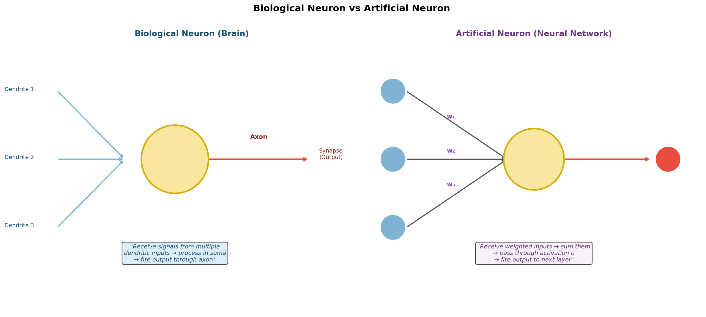
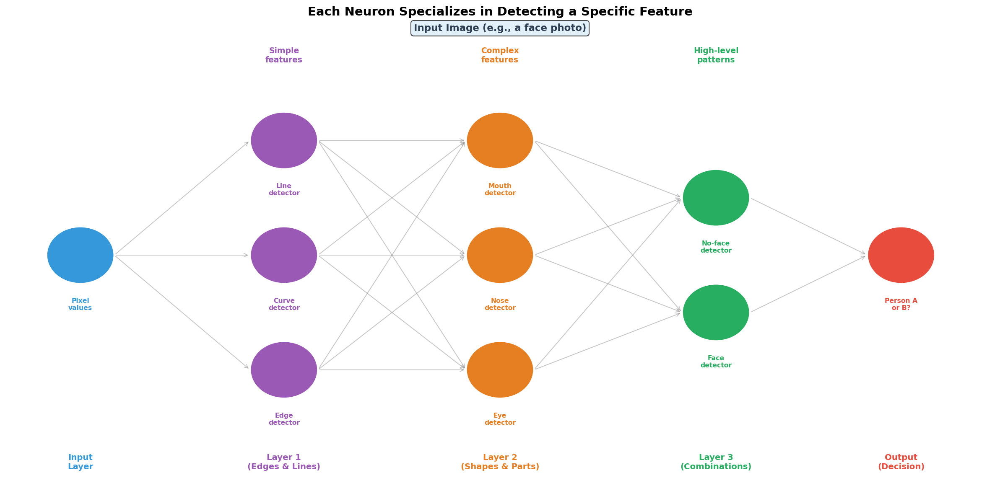
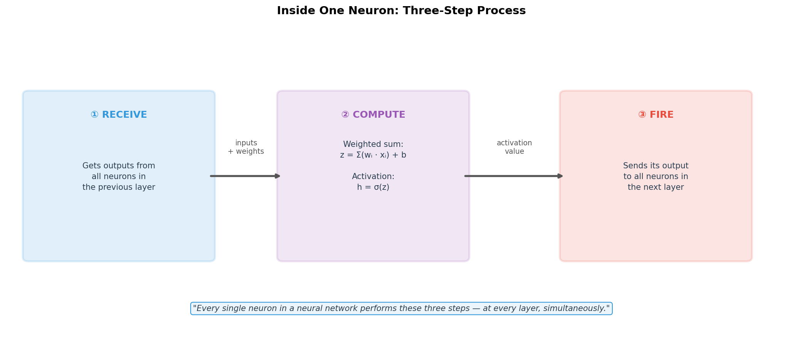
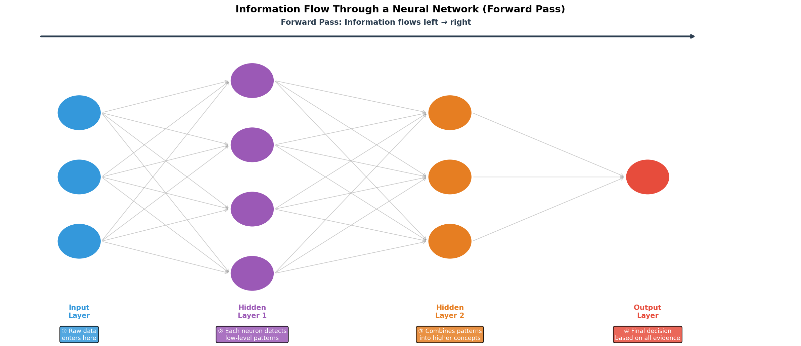
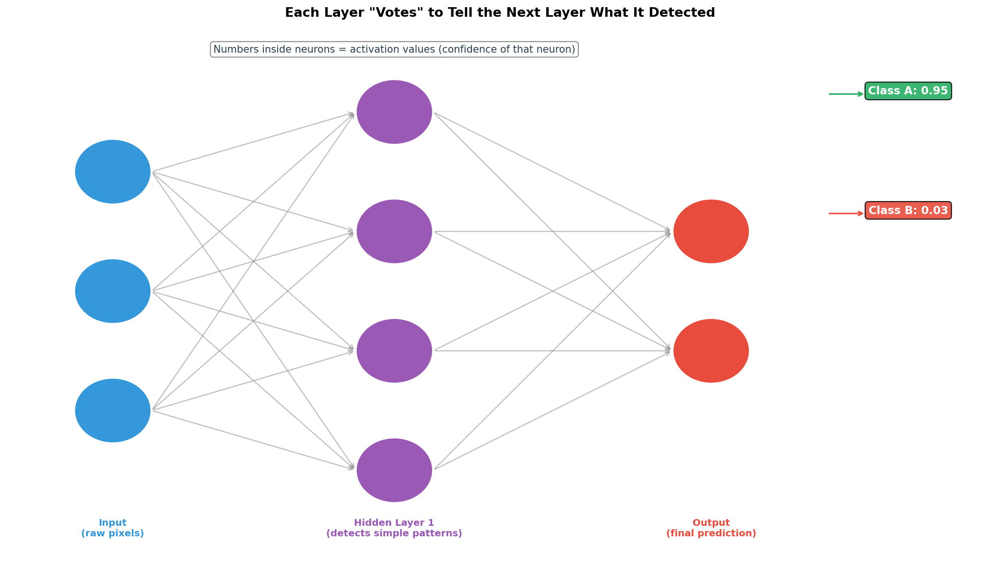
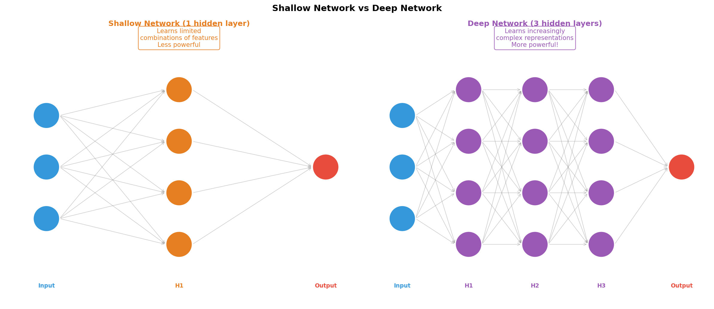

# Basic Idea of a Neural Network

This document explains the **core intuition** behind how a neural network thinks, learns, and makes decisions — building directly on the MLP architecture. The key insight: every neuron is a **specialist**, and specialists pass their findings up through the layers until a final expert makes the ultimate call.

---

## 1. Where Does the Idea Come From? The Biological Neuron

Before understanding artificial neural networks, look at where the idea came from — the human brain.



| Biological Neuron | Artificial Neuron |
|---|---|
| Receives signals via **Dendrites** | Receives signals via **Input values (x)** |
| Processes in the **Soma (cell body)** | Computes **weighted sum + activation** |
| Fires output through the **Axon** | Sends output to the **next layer** |
| Connected to other neurons via **Synapses** | Connected via **Weights (w)** |

> **The core principle is the same:** A neuron collects information from many sources, processes it, and decides whether to pass a signal forward.

---

## 2. The Key Idea: Every Neuron is a Specialist

This is the fundamental concept of neural networks:

> **Each neuron specializes in detecting or responding to a specific pattern or feature. It does NOT try to understand everything — it just does one job well and passes the result forward.**

Think of it like an organization:
- A junior analyst detects **edges** in data
- A mid-level analyst combines edges into **shapes**
- A senior analyst combines shapes into **objects**
- The manager (output layer) makes the **final decision**



### Real Example: Face Recognition

| Layer | What Each Neuron Detects |
|---|---|
| **Layer 1 (Early)** | Simple edges, curves, lines, corners |
| **Layer 2 (Middle)** | Eyes, nose, mouth, ears (combinations of edges) |
| **Layer 3 (Late)** | Full face structures, expressions, orientations |
| **Output Layer** | "Is this Person A or Person B?" |

Each layer builds on the **detections of the previous layer** — this is the chain of specialists passing information upward.

---

## 3. What Happens Inside One Neuron?

Every single neuron, at every layer, does the same three-step process:



### Step 1 — RECEIVE
The neuron collects the **output values** of every neuron from the previous layer. Each connection carries a **weight** — the network's way of saying "how much should I trust this particular input?".

### Step 2 — COMPUTE
The neuron calculates a **weighted sum** of all its inputs, then adds a bias, then passes it through an **activation function**:

$$
z = w_1 h_1 + w_2 h_2 + \ldots + w_n h_n + b
$$

$$
\text{output} = \sigma(z)
$$

The activation function $\sigma$ is the neuron's judgment call — it decides how strongly to fire its signal to the next layer.

### Step 3 — FIRE
The neuron sends its computed output value to **every neuron in the next layer**. Each of those neurons will use this as one of their inputs.

> **This three-step cycle repeats for every neuron, at every layer, from left to right — this is called the Forward Pass.**

---

## 4. Information Flow: The Forward Pass

The journey of data through a neural network — from raw input to final prediction — is called the **Forward Pass**.



Here's how it works, layer by layer:

```
Raw Input Data
      ↓
  Input Layer    → Just receives and passes raw values (x₁, x₂, ... xₙ)
      ↓
Hidden Layer 1   → Each neuron detects simple low-level features
      ↓
Hidden Layer 2   → Each neuron combines low-level features into complex patterns
      ↓
  Output Layer   → Makes the final prediction based on ALL the evidence
      ↓
  Final Answer   → Class label, probability, or value
```

**The critical point:** Each layer's neurons receive outputs from the previous layer and produce inputs for the next layer. Information always flows **forward** (left to right) during prediction.

---

## 5. The "Voting" Mechanism: How Layers Communicate

Each neuron in a layer produces a number between 0 and 1 (with Sigmoid) or above 0 (with ReLU). This number is the neuron's **confidence score** — its "vote" for how strongly it detected its specialized feature.



The next layer then takes **all these votes as input** and computes its own weighted judgment. This cascades all the way to the output layer which collects the final summary of all evidence from all previous layers and makes the ultimate decision.

> **Think of it like a courtroom:** Each hidden neuron is a witness giving testimony (their activation value). The judge (output neuron) weighs all the testimony and delivers a verdict.

### Example: Is this email spam or not?

| Layer | Neuron's Specialty | Its Vote |
|---|---|---|
| H1-Neuron 1 | "Did I detect all-caps words?" | 0.9 (yes, strong signal) |
| H1-Neuron 2 | "Did I detect money-related words?" | 0.85 (yes) |
| H1-Neuron 3 | "Is sender in known contact list?" | 0.05 (no) |
| H2-Neuron 1 | "Does this match spam patterns?" | 0.92 (combining above) |
| **Output** | **"Is this spam?"** | **0.95 → YES, Spam!** |

---

## 6. Why Multiple Layers? Shallow vs Deep

What happens if we add more layers?



| Network Type | Layers | What It Can Learn |
|---|---|---|
| **Shallow (1 hidden)** | Input → 1 hidden → Output | Simple patterns, limited combinations |
| **Deep (3+ hidden)** | Input → many hidden → Output | Hierarchical, highly complex patterns |

A **deep network** (= many hidden layers) can learn increasingly **abstract and complex representations**:
- Layer 1 learns: raw patterns
- Layer 2 learns: combinations of those patterns
- Layer 3 learns: combinations of combinations
- ...and so on

> **This is why it's called "Deep Learning" — the "depth" refers to the number of hidden layers.**

---

## 7. The Complete Picture: Neural Network as an Assembly Line

The best mental model for a neural network is an **assembly line of specialists**:

```
 INPUT           HIDDEN LAYER 1        HIDDEN LAYER 2         OUTPUT
─────────        ──────────────        ──────────────         ──────
Raw data    →    Detect simple    →    Combine into      →    Final
(pixels,         patterns             complex features        decision
 numbers,        (edges, tones)       (shapes, objects)       (class,
 features)                                                     score)

         Each neuron is a specialist.
         Each layer builds on the previous layer's work.
         The final layer combines ALL the work into a single answer.
```

---

## 8. Summary

| Concept | Key Point |
|---|---|
| **Single Neuron** | Receives inputs, computes weighted sum + activation, fires output |
| **Specialization** | Each neuron learns to detect one specific pattern |
| **Layer-to-layer** | Each layer's outputs become the next layer's inputs |
| **Forward Pass** | Information flows input → hidden layers → output (left to right) |
| **Voting** | Each neuron's activation is its "confidence vote" passed to the next layer |
| **Deep vs Shallow** | More layers = more abstract, complex feature learning |
| **Final Layer** | Collects all evidence from all previous layers → makes ultimate decision |

> **The Big Takeaway:** A neural network is NOT one smart brain — it is a chain of simple specialists. Each specialist does a tiny, focused job. Combined together, these specialists can solve incredibly complex problems that no single specialist could ever handle alone.
